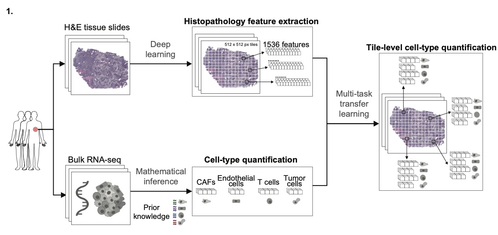

# Integrating histopathology and transcriptomics for spatial profiling of the tumor microenvironment: a melanoma case study

> Pipeline has been successfully tested with fresh frozen (FF) slides only. Currently, only the TF models for SKCM (melanoma) are readily available in /data/TF_models.

Our pipeline (SPoTLIghT) to derive spatial graph-based interpretable features from H&E (fresh-frozen, FF) tissue slides is packaged as a docker or a singularity/apptainer container.

The pipeline comprises the following steps:
1. Extract 1,536 histopathological features from Inception V4 model.
2. Predict tile level abundances for the different cell types.
3. Compute spatial features.

See also the figures below.




## Run SPoTLIghT

1. Build the docker image as follows:

```bash
docker build -t run_spotlight:vfinal . --platform linux/amd64
```

Alternatively you can use Singularity/Apptainer (HPCs):

```bash
# 1. save docker as tar or tar.gz (compressed)
docker save run_spotlight:vfinal -o {output_dir}/spotlight_docker.tar.gz
# 2. build apptainer (.sif) from docker (.tar)
apptainer build {output_dir}/spotlight_apptainer.sif docker-archive:spotlight_docker.tar.gz
```

2. Add your FF histopathology slides to a subdirectory in the `spotlight_docker` directory, e.g. `data_example/images`

3. Download retrained models to extract the histopathological features, available from Fu et al., Nat Cancer, 2020 ([Retrained_Inception_v4](https://www.ebi.ac.uk/biostudies/bioimages/studies/S-BSST292)). 
Once you unzip the folder, extract the files to the `data/checkpoint/Retrained_Inception_v4/` folder.

4. If a TCGA dataset is used, please download metadata (i.e. "biospecimen -> TSV", unzip and keep slide.tsv), then rename `slide.tsv` to `clinical_file_TCGA_{cancer_type_abbrev}` such as `clinical_file_TCGA_SKCM.tsv` and copy to `/data`. Example dataset TCGA-SKCM can be downloaded [here](https://portal.gdc.cancer.gov/projects/TCGA-SKCM)

5. Setup your paths and variables in `run_pipeline.sh`

```bash

# Directory 'spotlight_docker'

work_dir="/path/to/spotlight_docker"
spotlight_sif="path/to/spotlight_sif"

# Define directories/files in container (mounted)

folder_images="/path/to/images_dir"
output_dir="/path/to/output_dir"

# Relative to docker, i.e. start with /data

checkpoint="/data/checkpoint/Retrained_Inception_v4/model.ckpt-100000"
clinical_files_dir="/data/path/to/clinical/TCGA/file.tsv"

# Remaining parameters (this configuration has been tested)
slide_type="FF"
tumor_purity_threshold=80
class_names="SKCM_T"
model_name="inception_v4"

# Indicate whether the slides arise from the TCGA project
is_tcga=false

````

## Output documentation

SPoTLIghT generates the following output directory structure:

```bash
{output_dir}
├── 1_histopathological_features
│   ├── bot_train.txt
│   ├── features.txt
│   ├── file_info_train.txt
│   ├── final_clinical_file.txt
│   ├── generated_clinical_file.txt
│   ├── pred_train.txt
│   ├── predictions.txt
│   ├── process_train
│   │   ├── images_train_00001-of-00320.tfrecord
│   │   └── images_train_00002-of-00320.tfrecord
│   └── tiles
│       ├── TCGA-EB-A3XC-01Z-00-DX1_2773_15709.jpg
│       └── TCGA-EE-A3JE-01Z-00-DX1_25873_12013.jpg
├── 2_tile_level_quantification
│   ├── test_tile_predictions_proba.csv
│   └── test_tile_predictions_zscores.csv
├── 3_spatial_features
│   ├── FF_all_graph_features.csv
│   ├── FF_all_schc_clusters_labeled.csv
│   ├── FF_all_schc_tiles.csv
│   ├── FF_clustering_features.csv
│   ├── FF_features_ND.csv
│   ├── FF_features_ND_ES.csv
│   ├── FF_features_ND_sim_assignments.pkl
│   ├── FF_features_ND_sims.csv
│   ├── FF_features_clust_all_schc_prox.csv
│   ├── FF_features_clust_indiv_schc_prox.csv
│   ├── FF_features_coloc_fraction.csv
│   ├── FF_features_lcc_fraction.csv
│   ├── FF_features_shortest_paths_thresholded.csv
│   ├── FF_graphs.pkl
│   ├── FF_indiv_schc_clusters_labeled.csv
│   ├── FF_indiv_schc_tiles.csv
│   ├── FF_shapiro_tests.csv
│   └── all_features_combined.csv
└── list_images.txt
```
