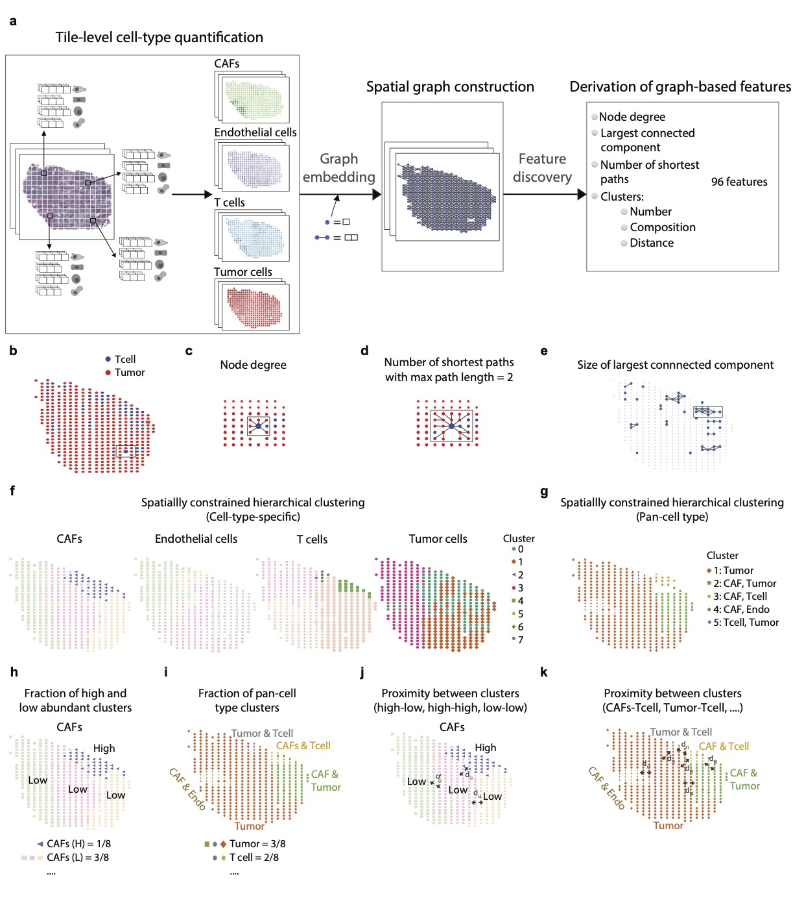

# Integrating histopathology and transcriptomics for spatial profiling of the tumor microenvironment: a melanoma case study

Our pipeline(SPoTLIghT) to derive spatial graph-based interpretable features from H&E tissue slides is packaged as a docker container.




First, build the docker image as follows:

```bash
docker build -t run_spotlight_example:v1 . 
```

Second, set the `WSI_TYPE` parameter to fresh-frozen `"FF"` or formalin-fixed, paraffin-embedded `"FFPE"` according to your whole slide images.
Then, run the docker to execute the pipeline.

```bash
docker run \
--build-arg WSI_TYPE="FF" \                                                  
-v $(pwd)/data/:/data:ro \
-v $(pwd)/data_example/:/data_example:ro \
-v $(pwd)/output_example/1_histopathological_features:/output_example/1_histopathological_features:rw \
-v $(pwd)/output_example/2_tile_level_quantification:/output_example/2_tile_level_quantification:rw \
-v $(pwd)/output_example/3_spatial_features:/output_example/3_spatial_features:rw \
run_spotlight_example:v1
```

The pipeline comprises the following steps:
1. Extract 1,536 histopathological features from Inception V4 model.
2. Predict tile level abundances for the different cell types.
3. Compute spatial features.
